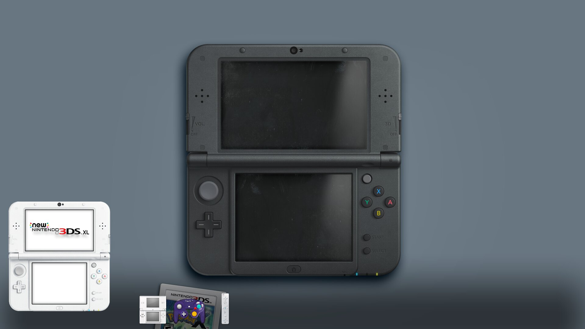
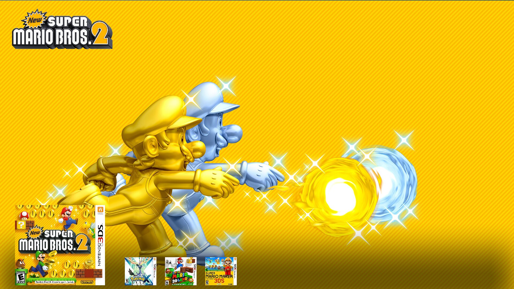
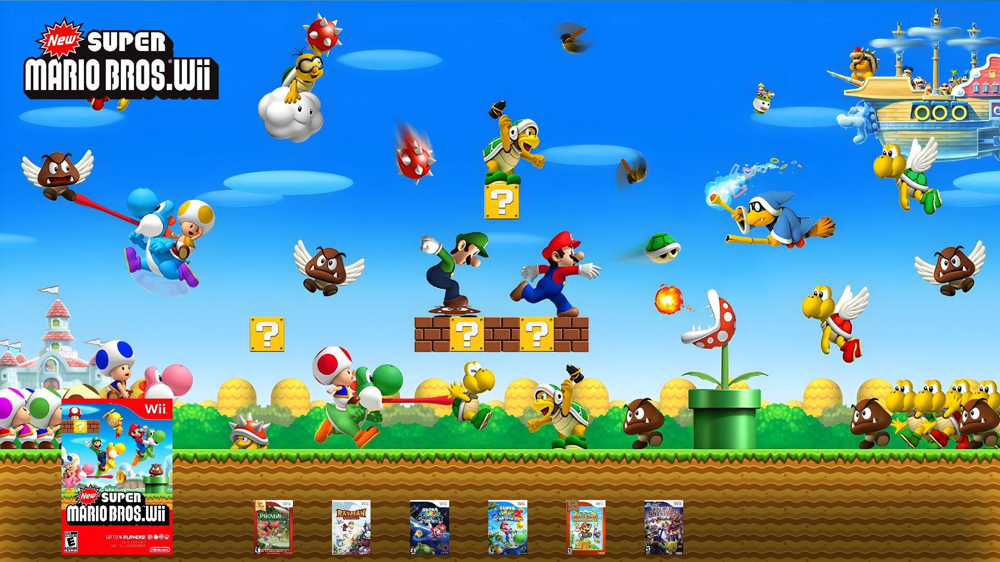

# Epic Memories

In order for the theme to work properly, collections must be named in the same way as emulationstation collections (ex: Nintendo DS -> nds, Nintendo GameCube -> gc etc.)

As video assets seem to be too large for github, they are available separately [here](https://mega.nz/folder/VW5HzagD#mMOkLeamV6S0UqXFPmxtcQ) (they are optionnal and the theme works without them).

### Dependencies

`gst-libav` to play the console videos

Arch : `sudo pacman -S gst-libav`

Debian : `sudo apt install gstreamer1.0-libav ubuntu-restricted-extras`

### Contributing

Feel free to open an issue if you notice something wrong, PRs are also welcome !

### Roadmap

- [ ] Gather sound effects/media fo all consoles (next page, ambiant sound, launch game, startup video)

- [ ] Add animation when launching a game

- [ ] Add sfx when launching a game

- [ ] Calibrate sfx so they are all at the same volume

- [x] Improve list animations (similar to prosperoOS)

- [ ] Add console startup video when selecting a console

- [ ] Upscale pictures so they look better on big screeens

- [ ] Add some game information (amount of players, time played etc)

- [ ] Create a settings menu to enable/disable various options (videos, sounds etc)

### Thanks/credits

I would like to thanks the following people :

- Pegasus-frontend devs who wrote the qml tutorials

- The devs of Prospero OS, great inspiration for some animations and sound effects

- Credits for the authors of [this](https://github.com/CkauNui/ckau-book), [this](https://github.com/fabricecaruso/es-theme-carbon) and [this](https://github.com/dragoonDorise/RP-epic-noir) theme for the media (images/videos)

- I do not own any of the provided media (images/videos/sounds). They are propriety of the console manufacturers
